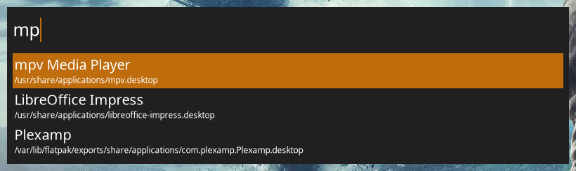

# gravel


[](https://aur.archlinux.org/packages/gravel-bin)



Gravel is a no-nonsense application launcher built for speed and efficiency.  
It supports fuzzy searching without any other heuristics, ensuring consistent performance and reliable, repeatable results. Sensible defaults coupled with a powerful configuration system allow you to get started quickly or spend some time dialing in your experience.


## Features

> Note: Plugins will be available with the v0.7.0 release.

- Native FLTK UI
- Plugins
- Global Hotkeys
- Flexible configuration
- Built-in providers:
  - Application launching
  - Calculator
  - Web searches
  - Shutdown, reboot etc.
  - Process killing
  - Shell command execution


# Installation

Binaries are available for the following x86-64 platforms:
| Platform |  |  |
| --- | --- | --- |
| Arch | [Package][arch-pkg] | [AUR][arch-aur] |
| Debian | [Package][debian-deb] | |
| Windows | [exe][windows-exe]

[arch-pkg]: https://github.com/thorio/gravel/releases/latest/download/gravel-x86_64.pkg.tar.zst
[arch-aur]: https://aur.archlinux.org/packages/gravel-bin
[debian-deb]: https://github.com/thorio/gravel/releases/latest/download/gravel-x86_64.deb
[windows-exe]: https://github.com/thorio/gravel/releases/latest/download/gravel-x86_64.exe

You can then start using gravel right away with the default hotkey alt + space, no configuration required.


### Configuration
Gravel uses a hierarchical configuration system, meaning you can set options at the user, platform and host level, each of which overrides the last. This allows for easy configuration re-use across systems while still retaining the freedom to configure differing options for each.

To get started, place [config.yml][config] from this repository in `~/.config/gravel/config.yml` and edit it to your liking. It contains explanations for each option as well as the configuration system itself.

[config]: ./config.yml


# Development

Using the devcontainer is highly encouraged to get up and running ASAP, otherwise:

- [Install Rust][rustup]
- Install Dependencies

  **Arch** or derivatives
  ```
  pacman -S libx11 libxext libxft libxinerama libxcursor libxrender libxfixes pango cairo libgl mesa coreutils gtk3 xdg-utils
  ```

  **Debian** or derivatives
  ```
  apt install libx11-dev libxext-dev libxft-dev libxinerama-dev libxcursor-dev libxrender-dev libxfixes-dev libpango1.0-dev libgl1-mesa-dev libglu1-mesa-dev
  ```

  **Windows**  
  Rustup installation should suffice.

- Use [normal cargo commands][cargo] for development (`cargo build`, `cargo run`), use [`cargo-make`][cargo-make] for packaging.

[rustup]: https://www.rust-lang.org/tools/install
[cargo]: https://doc.rust-lang.org/cargo/
[cargo-make]: https://github.com/sagiegurari/cargo-make


### Architecture

Gravel has three core components:
- Frontend: the UI you interact with, where you enter your queries and select the hits.
- Query Engine: forwards the query to the providers, then scores and processes the hits.
- Providers: process the query and return hits, like programs, system actions or math hits.

Both the frontend and provider components can be swapped out via plugins, allowing you to mold Gravel to your exact needs.


### Plugins

> Note: Plugins will be available with the v0.7.0 release.

Plugins are implemented using [`abi_stable`][abi-stable], thus allowing libraries to be loaded at runtime. Writing a provider is quite straightforward, take a look at [the example provider][example-provider] for an overview.

Gravel's version _is_ the version of the plugin interface, which follows [semver][semver].

[abi-stable]: https://docs.rs/abi_stable/latest/abi_stable/
[example-provider]: ./examples/example-provider
[semver]: https://semver.org/
