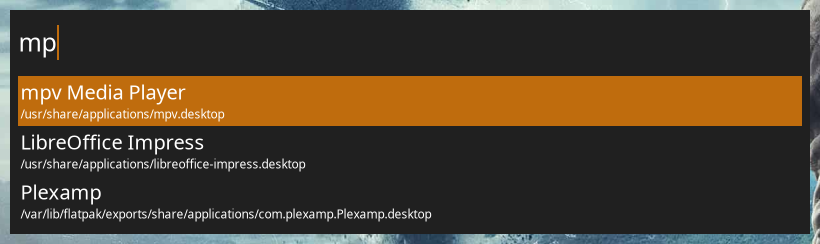

# gravel

## Current Features
- Basic FLTK UI
- Hotkey support
- Desktop entry (Linux) and start menu (Windows) application launching
- Calculator
- Web searches
- Shutdown, reboot etc.
- Process killing
- Shell command execution

## Goals
- Cross-platform support for Linux and Windows
- Convenient installation for Arch, Debian and Windows
- Good performance, even on slow systems
- Plugin support
- Flexible configuration
